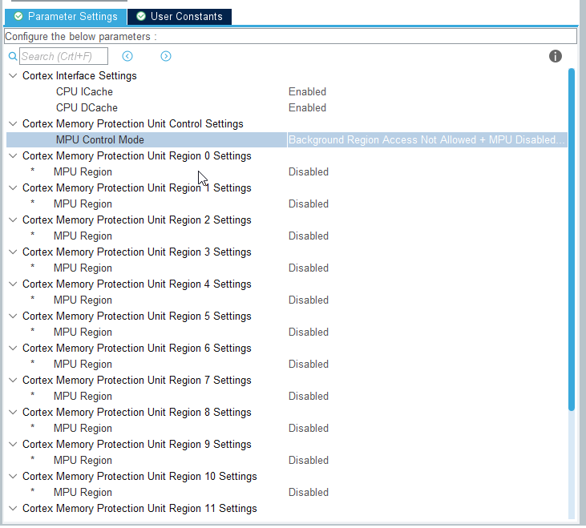

# Creating project H747 and LWIP

## CubeMX

Open CubeMX
Start new project 
1. Menu
2. File
3. New project
   


1. Select STM32H747 Nucleo board
2. No default configuration (we want only pin highlite)


## Configure Eth mode

1. Select Eth periphery (over A-Z tab)
2. Select core where Eth will be used (M7)
3. Select mode RMII (used on Discovery)
4. 


## Configure Eth

1. Set buffer locations (to be compatible with most of H7 family we use SRAM1 0x30000000)
    1. 0x30000060 for TX descriptor(4)
    2. 0x30000000 for RX descriptor(4)
    3. 0x30000200 for RX buffers
2. Enable Ethernet global interrupt in NVIC tabl
3. Set all pins to high speed


## Core M7 configuration (not needed for M4)

1. Select Cortex_M7 periphery
2. Enable Data and Insturction cache
3. Enable MPU with default region w or wo MPU in hault
   


### Mpu confiuration

#### Default settings to prevent speculative reads to FMC/QSPI/OSPI area

This will prevent specula tive reads to this area done by M7 it is goot to have it there by default. We set memory area 0x60000000 to 0xD0000000 as not accesible.

1. Enable Region 0
2. Set address 0x0
3. Size 4GB
4. Subregion disable 0x87 (this will target only 0x60000000 to 0xD0000000)
5. TEX 0 
6. ALL ACCESSS NOT PERMITTED
7. Disable instruction access
8. Not sharable
9.  Not cachable
10. Not bufferable



#### RX buffers

One configuration is needed fo RX buffers from 0x30000000 size 32KB. We set this area as `Normal non cachable`(TEX1+Not bufferable + Not cachable)

1. Enable Region 1
2. Set address 0x30000000
3. Size 32KB
4. Subregion disable 0x0
5. TEX 1 
6. ALL ACCESSS PERMITTED
7. Enable instruction access
8. Non sharable
9.  Not cachable
10. Not bufferable


#### TX and RX descriptors

One configuration is needed for Eth RX buffers and second for RX and TX descriptors set above. 
So we will create one region for RX and TX descriptors set as `device`(TEX0+Bufferable + Not cachable) from 0x30000000 size 256B.
The buffers can overlap but 32K must be first. 

1. Enable Region 2
2. Set address 0x30000000
3. Size 256B
4. Subregion disable 0x0
5. TEX 0 
6. ALL ACCESSS PERMITTED
7. Disable instruction access
8. Non sharable
9.  Not cachable
10. Bufferable


## LwIP mode

1. Select LwIP periphery
2. Select M7 core 
3. Enable


## LwIP configuration

### (Optional)Disable DHCP

I'll test this between two PC so no DHCP is present to assing IP address

1. General Settings
2. Disable DHCP
3. Select your IP address 192.168.0.7 in my case


### Set LwIP buffer

We must set buffer for LwIP heap
We use our area around 0x30000000 and we set 0x30004000. And size 16KB.

1. Key options tab
2. Set LWIP_RAM_HELP_POINTER to 0x30004000
3. MEM_SIZE 1024*16


### Select platform

1. Platfrom settings
2. Select Driver_phy LAN8742
3. Select LAN8742
   


## Clock configuration

1. Select Clock configuration tab
2. Set clocks as you need

## Project manager

1. Set project location
2. Set project location
3. Set CubeIDE
4. Generate project


# CubeIDE

1. Open CubeIDE
2. Select workspace


## Import project

1. File
2. Import
3. General
4. Existing Project into workspace
5. Select project location (If workspace is abowe project then only select)
6. Select all project for M4, M7 & Common
   


## Modify linker

Because we have descriptors and buffers on specific place we must them put them on this place with linker

1. Open M7 project
2. Open Linker file STM32H747XIHX_FLASH.ld
3. Put there (usually before .data section)
   
  ```c
    .lwip_sec (NOLOAD) : {
    . = ABSOLUTE(0x30000000);
    *(.RxDecripSection) 
    
    . = ABSOLUTE(0x30000060);
    *(.TxDecripSection)
    
    . = ABSOLUTE(0x30000200);
    *(.RxArraySection) 
  } >RAM_D2
  ```


## Add define to enable SRAM in D2

We must set compiler to use SRAM in D2 from M7 core. We mut add `DATA_IN_D2_SRAM ` to defines.

1. Right click on M7 project
2. Properties
3. C/C++ Build
4. Settings
5. Tools Setttings
6. MCU GCC Compiler
7. Preprocesor
8. Define symbols
9. Add `DATA_IN_D2_SRAM `
10. Apply
11. Apply and Close 


## Use LwIP periodic process

The lwIP for work need to be peridically called. For this we must add to our main a `MX_LWIP_Process` function. 
Like this into while(1) loop in main.c:

```c
  /* Infinite loop */
  /* USER CODE BEGIN WHILE */
  while (1)
  {
	  MX_LWIP_Process();
    /* USER CODE END WHILE */

    /* USER CODE BEGIN 3 */
  }
  /* USER CODE END 3 */
```

## Compile code

Compile code with CTRL + B

## Donwload code

First download M4 project

1. Select M4 project
2. Run
3. Debug as 
4. Stm32 Cortex M ...
5. Debug
6. Wait for code download
7. Terminate debug


Download M7 project 

1. Select M4 project
2. Run
3. Debug as 
4. Stm32 Cortex M ...
5. Debug
6. Wait for code download
7. Terminate debug


## Test

You can connect the board to PC with same ip adders range 192.168.0.xxx and try to ping our board by

```
ping 192.168.0.7
```